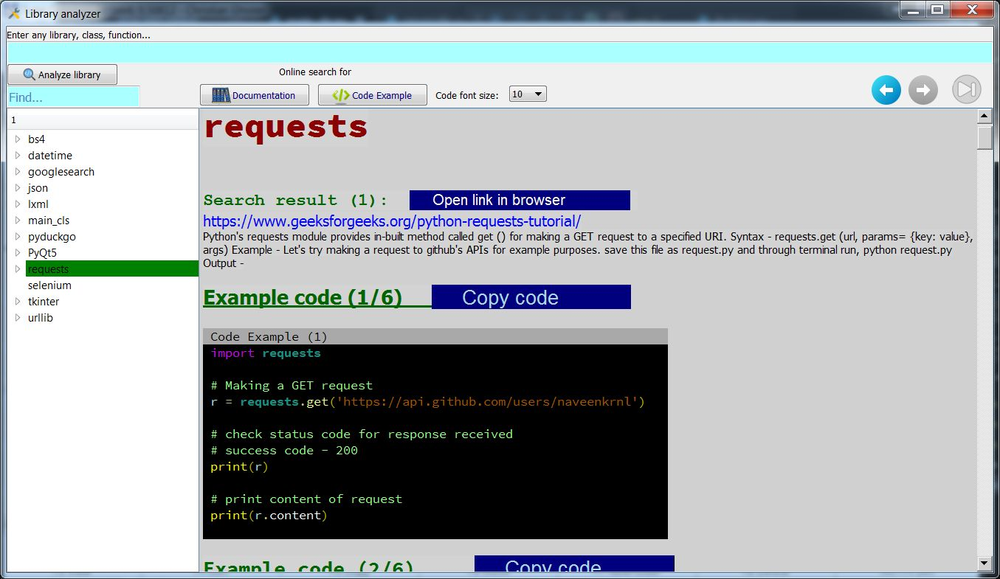

# Python Library Information Tool

This program allows you to enter the name of any Python library and view information on its classes, methods, functions, constants, and more. The information is displayed in a QTreeWidget, making it easy for you to navigate and access the different components of the library. Simply enter the name of the library you're interested in and explore all the valuable resources it has to offer.

## Getting Started

### Prerequisites 

Before running this application, make sure you have the following installed:
	- Python 3.x
Libraries:
	- PyQt5
	- importlib
	- json
	- webbrowser
	- bs4 (BeautifulSoup)
	- requests
	- urllib
	- inspect
	- lxml

## Usage 

To use the program, simply run the `main_cls.py` file and enter the name of the Python library you're interested in exploring. The program will search for and load information on all direct subclasses of the library, as well as any additional data that is loaded as you navigate through the QTreeWidget.

You can use the search feature to find specific components within the library.

## Contributing 

If you have any suggestions or find any bugs in the program, please feel free to open an issue or submit a pull request on GitHub.

## License 

This project is licensed under the MIT License - see the `LICENSE` file for details.
